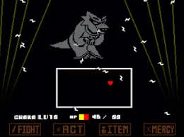
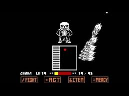

*   [Home](index.html)
*   [Proposal](proposal.html)
*   [Documentation](documentation.html)
*   [Project](#)

# STAY AWAY!

## I. High Concept

Players must avoid being touched at all costs!

## II. Genre

Arcade

## III. Platform

Desktop Only

## IV. Story

Suriv is a simple man who simply does not like the sight of sickly germs. He is what you would call a Germaphobe.  

As Suriv grew older, his fear of germs prevented him from befriending many people as he would distance himself physically and socially from everyone he met. The few that were able to make friends with him at work wanted to celebrate his upcoming birthday with a party at work! Little do they know how much Suriv hates parties...  

It is up to you to help Suriv survive his birthday filled with cake and germs flying right at him.

## V. Aesthetics

Graphics style - Cartoonish  

Sound - 8-bit / Techno  

There will likely be some sounds for when there is cake and germs being thrown. As well as footstep sounds and some sounds for when Suriv gets hit.

## VI. Gameplay

### Mechanics

There will be things thrown around the screen like cake or bacteria that you must avoid touching at all costs. Your only main goal is to try and stay alive as long as you can.

### Control

You will be able to choose between using WASD keys or your mouse to move around the screen to avoid getting hit.

### Onboarding

Based off the title and the simplicity of the controls, it should be integrated into the gameplay on how to play the game. If anything players will be able to learn as they play.

### Player Learning

The player needs to learned to dodge and be quick about it. As time goes on, the frequency in which objects will be flying around the screen will increase. There may be a chance for gloves (aka an hp-up) to spawn on the screen to help you survive a little longer.  

There isn't a really well defined strategy for this as the objects will spawn in at random and in random locations. The main thing you can do is try to not tunnel and focus on one object as you will likely lose track of everything else flying towards you.

## VII. Screenshots

 

## VIII. About the Developers

Hello! My name is Brandon Ly. I'm currently a second year Game Design and Development student. I do programming a lot of the time, but I also do illustrations and read lore in games I play on the side when I have the time. Pleasure to have you on my page.
